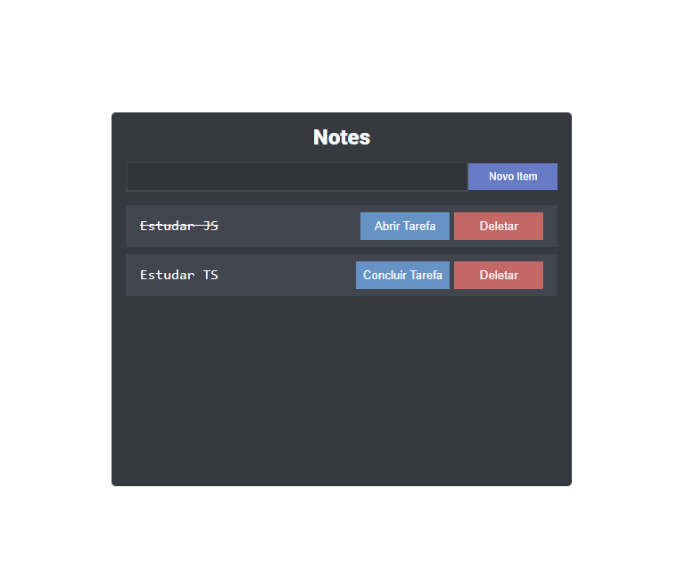

# JavaScript - DOM

  

## Curso/Course
[JS na Web: Manipule o DOM com JavaScript | Alura](https://cursos.alura.com.br/course/javascript-manipulacao-dom)

## Linguagens e Ferramentas/ Languages and Tools

## Aprendido durante o Curso / Learned during the Course
- Percorrer a árvore do DOM
- Utilizar o querySelector para selecionar elementos da árvore do DOM
- Funcionamento da estrutura do DOM

- Utilizar data-attributes
- Utilizar o método addEventListner para escutar eventos no elemento
- Prevenir o comportamento padrão do formulário

- Adicionar classe CSS utilizando o método toggle
- Utilizar o atributo parentElement para subir um elemento na árvore do DOM
- Encontrar o alvo do evento utilizando a propriedade target
- Utilizar IIFE

- Utilizar import/export
- Remover elementos do DOM com o método remove
- Entender Same Origin Police e CORS
## Recomendações
https://cursos.alura.com.br/data-attributes-do-html5-c109