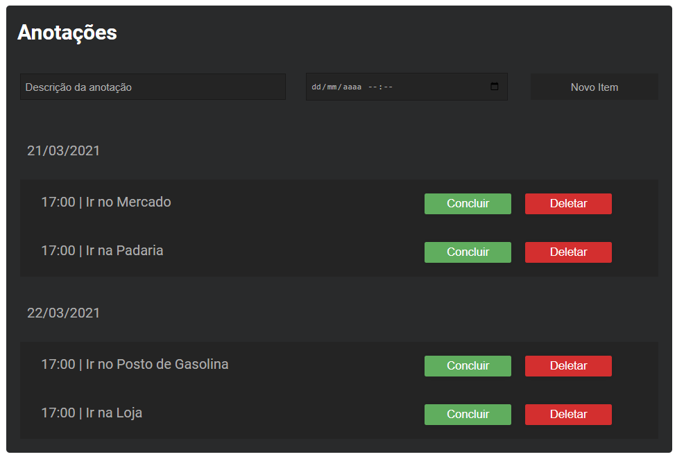

# JavaScript - WEB

  

## Curso/Course
[JS na Web: Armazenando dados no navegador | Alura](https://cursos.alura.com.br/course/js-web-armazenando-dados-navegador)

## Linguagens e Ferramentas/ Languages and Tools

## Aprendido durante o Curso / Learned during the Course
- Utilizar componente de calendário
- Manipular datas
- Desestruturar objetos em JavaScript

- Salvar dados no navegador utilizando SessionStorage
- Armazenar dados sem encerrar a sessão com e LocalStorage
- Transformar objetos em string utilizando JSON.stringify()

- Iterar sobre os itens do LocalStorage
- Utilizar o curto circuito para verificação lógica
- Converter os itens que antes eram strings em objetos com JSON.parse

- Filtrar elementos de um array
- Ordenar elementos do LocalStorage

- Alterar um estado utilizando operador de negação
- Remover dados do LocalStorage utilizando o método splice
## Recomendações
https://cursos.alura.com.br/destructuring-em-js-c308